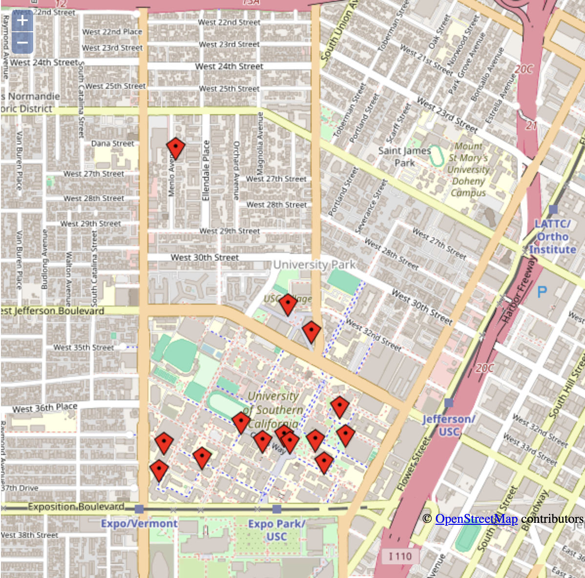
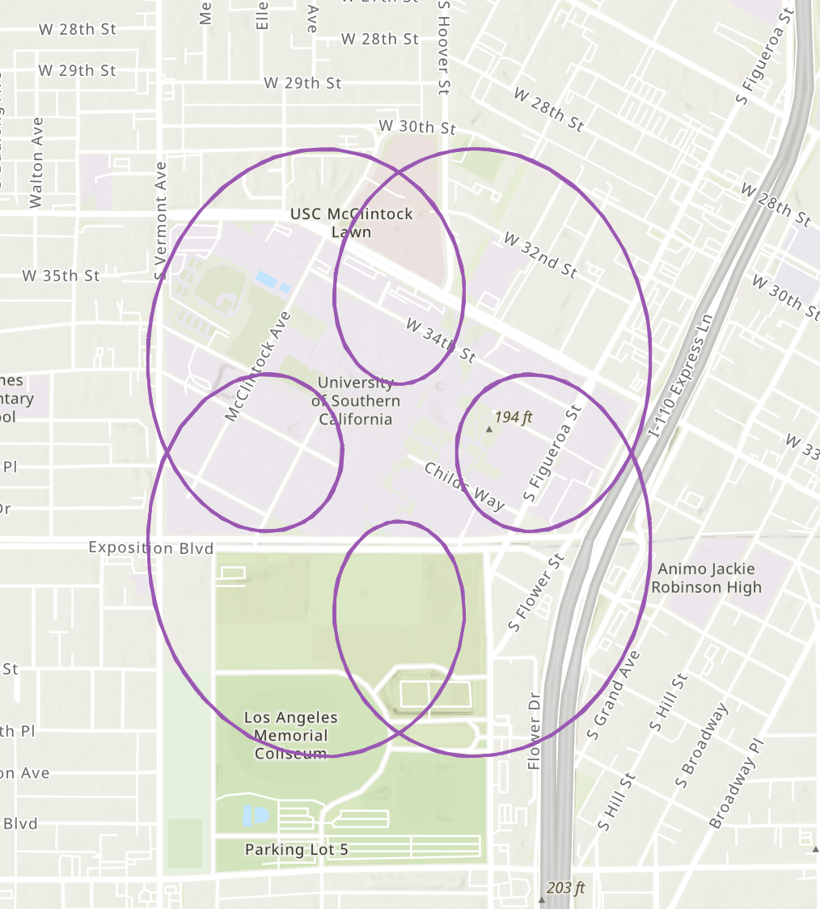
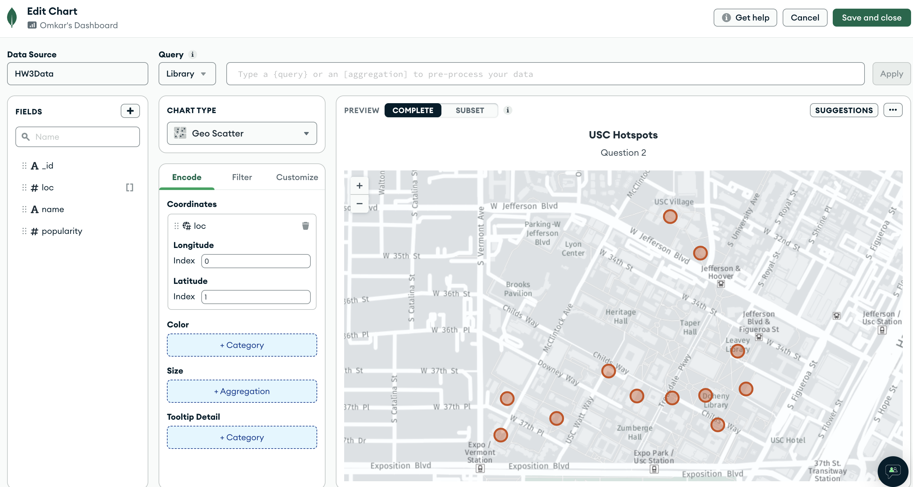
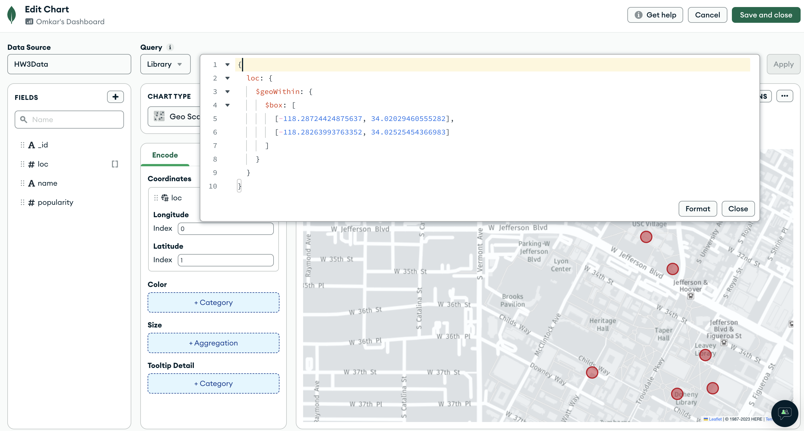
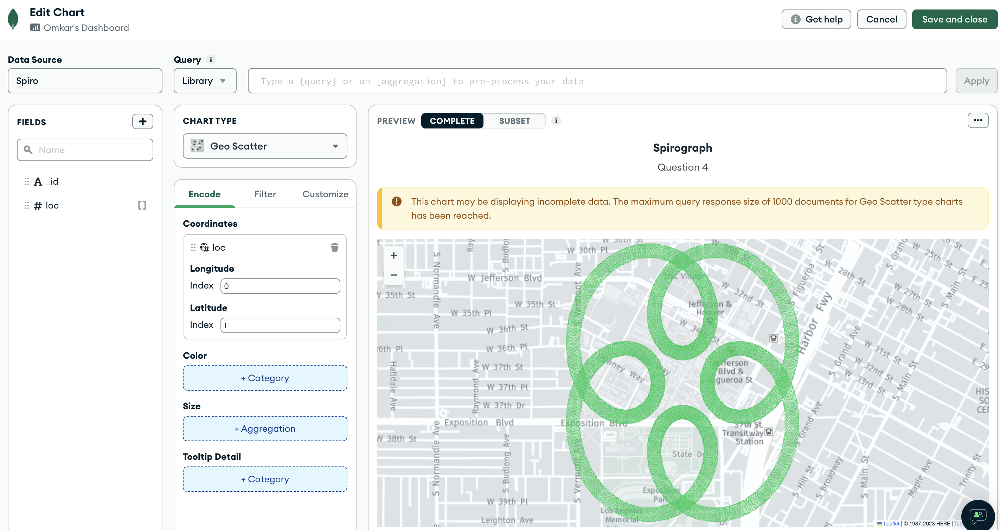
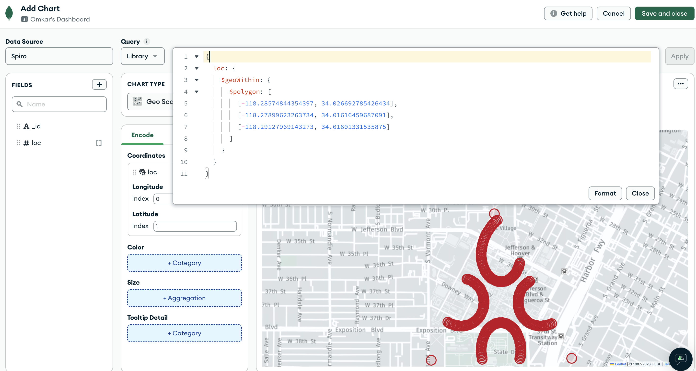
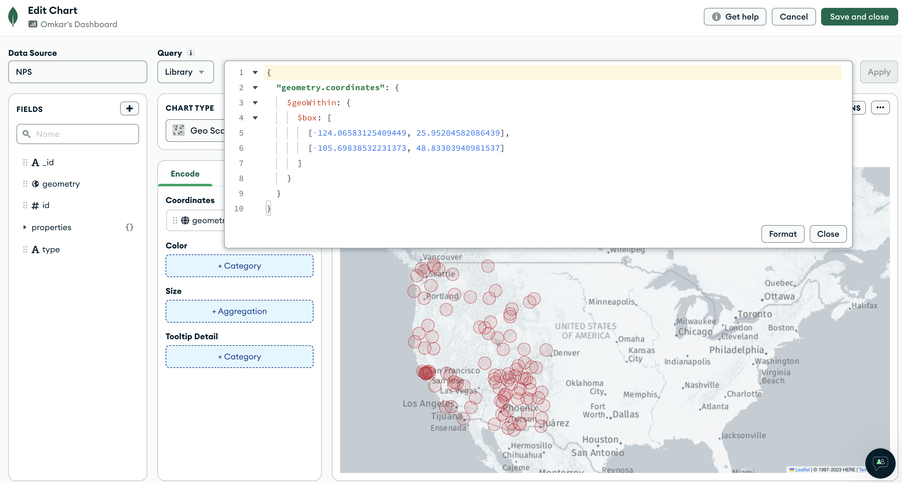

# Geospatial-Analysis
Analyse the different geolocations

### 1. Geospatial mapping using Google Earth and KML
* [Placemarks-Nearest-Neighbors.kml](placemarks_nearest_neighbors.kml): Placed 12 coords (and home coordinates) in four KML 'folders' - 'libraries', 'eateries', 'waterworks' and 'department buildings'.
* Install Google Earth and visualize the data from the KML file
  * Simply copy and paste your KML data into the textbox on the left
  * Click 'Show it on the map' to have it be displayed

### 2. Geospatial Queries using POSTGIS
1. Compute Convex Hull
   * [Spatial_queries.sql](spatial_queries.sql): Compute the convex hull for the 13 points (a convex hull for a set of 2D points is the smallest convex polygon that contains the point set) 
   * Use the query results to create a polygon in the `.kml` file 
   * Load this into Google Earth and visually verify that all your points are on/inside the convex hull

2. Compute Nearest Neighbors
   * [Spatial_queries.sql](spatial_queries.sql): Compute the four nearest neighbors from home location
   * Use the query's results to create four line segments in your `.kml` file
   * Load this into Google Earth and visually verify if it looks correct

### 3. Visualize using Openlayers (Javascript API)
* [Openlayers](open_layers.html): Open the file using chrome 
* The idea is to store your 13 sampled points, via web browser, in a browser cache area of the local machine, where the data would persist (even after you close the browser)
* Now, read back the stored values, and visualize them, using the OpenLayers API

### 4. Spirograph

* [Coord_generator_script.py](coord_generator_script.py): Use this script to generate co-ordinates (`.kml` file) around one geospatial point
* [Sprio.kml](spiro.kml): To visualize the spirograph in Google Earth
* Additionally, convert the KML to an ESRI `shapefile` to visualize the shapefile data using ArcGIS Online
  * To convert your .kml into a shapefile, use this online converter: https://mygeodata.cloud/converter/kml-to-shp - the result will be a .zip (which is what we call 'shapefile')
  * Once you have shapefile, upload it to ArcGIS online map creator to view your Spirograph curve-shaped points by logging onto ArcGIS (after creating a free public account), at https://www.arcgis.com/
  * Use the `Map` tab, followed by `Add -> Add Layer from File`, and upload the shapefile .zip

### 5. Spatial Data Analysis using MongoDB

* Use the above 12 coordinates to visualize using MongoDB charts

* Display the northern half of 12 coordinates using bounding box

* Spirograph using MongoDB charts

* Triangular bounding box of spirograph coords using polygon

* Display all the national parks to west of `Rockies` in United States

